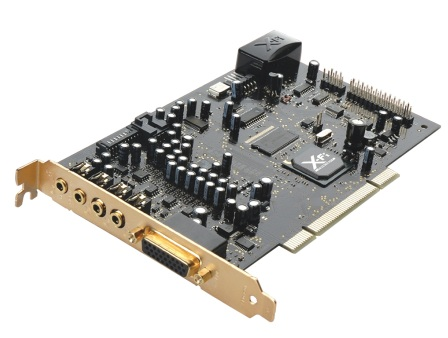

# Tarjetas de sonido

Una **tarjeta de sonido** o **placa de sonido** es una tarjeta de expansión para computadoras que permite la salida de audio controlada por un programa informático llamado controlador (driver). Éstas pueden estar conectadas a la placa base o ir integrada en la misma.

# Índice
* [Historia](#Historia)
* [Funcionamiento](#Funcionamiento)
* [Conexiones](#Conexiones)
* [Conceptos](#Conceptos)
* [Listado de estándares](#Listado-de-estándares.)
* [Otra información](#otra-información)
 
# Historia 
###### [Índice](#Índice)

Generalmente al encender un ordenador, la placa base hace una especie de escaneo a todo el sistema para comprobar si todo está en regla y continuar cargando. Y siempre que lo encendamos el modo que tiene la placa base de transmitir el estado del sistema es por medio de pitidos. Durante muchos años este era el único sonido que emitían los pc, ya que en un principio los ordenadores no fueron pensados para manejar sonido, el altavoz interno simplemente servía para comunicar errores al usuario. 

Pero el gran cambio surgió cuando empezó a aparecer el software que más ha hecho evolucionar a los ordenadores desde su aparición: los videojuegos. Y a estos se les suma más tarde la revolución de la música digital y la popularización de los instrumentos digitales.

La necesidad de una mayor calidad de sonido llevó a una empresa canadiense a crear en 1987 la tarjeta de sonido llamada AdLib Music Synthesizer Card (en diminutivo AdLib), no fue esta la primera tarjeta de expansión que podía generar sonido pero si la más importante. Esta tarjeta estaba principalmente compuesta por otros componentes externos de distintas compañías teniendo el chip [Yamaha YM3812](https://es.wikipedia.org/wiki/Yamaha_YM3812 "Yamaha YM3812") como el más relevante y un par de circuitos integrados de sonido especializados. Con la tarjeta AdLib, el software de la PC podía generar música multitímbrica y efectos de sonido, aunque la calidad acústica era distintivamente sintética. 

> El primer juego en apoyar esta tecnología fue [ King's Quest IV](https://es.wikipedia.org/wiki/King%27s_Quest_IV:_The_Perils_of_Rosella) en 1988 y posteriormente se le sumaron otros juegos esperando tener también una ventaja competitiva. 

Pero la repercusión de la tarjeta AdLib no fue demasiado lejos por dos razones: la poca o nula publicidad y el haber sido creada  a partir de componentes de otras compañías. Esto permitió que la empresa Creative Technology sacase al mercado en 1989 la tarjeta Sound Blaster que llevaba el mismo chip Yamaha YM3812 y le permitió una compatibilidad perfecta con la tarjeta AdLib y todo el software desarrollado en base a ella. Además la Sound Blaster mejoraba la tarjeta AdLib con la adición de un canal de efectos digitales de voz simple (PCM) y un puerto para juegos conectable tanto con un joystick como con un teclado MIDI.  La adición del canal PCM fue vital en la ascensión de Sound Blaster al dominio. No sólo permitió a los juegos reproducir sonido digitalizado (para efectos más realistas) sino que el hardware detrás de ella (chip DSP) obstaculizó los esfuerzos de los competidores de copiarlo exactamente.

Cuando la empresa AdLib intentó responder con una nueva tarjeta a la Sound Blaster ya era demasiado tarde y meses después de la sacar una segunda tarjeta llamada AdLib Gold se declararon en bancarrota. La Sound Blaster y sus posteriores versiones dominaron el mercado de las tarjetas de ordenadores durante gran parte de la década de los 90, incluso a día de hoy se trata de una de las marcas mas relevantes en el mercado de las tarjetas de sonido.
En 1997 Intel Architecture Lab desarrolla un estándar de audio usado principalmente en las placas base, el AC'97.
> AC significa Audio Codec y hace referencia a la codificación/decodificación del audio.

En 2004 el estándar AC’97 fue reemplazado por  Intel HD Audio [Intel High Definition Audio](https://es.wikipedia.org/wiki/Intel_High_Definition_Audio).

*Imágenes de ejemplo:*

Tarjeta AdLib        
 

Tarjeta Sound Blaster 1.0             
 

Chip Yamaha YM3812                     
 

Realtek ALC 882 HD Audio Codec, integrado en una placa base.                
 

# Funcionamiento
###### [Índice](#Índice)

La tarjeta de sonido convierte los datos de audio digital entrantes en audio analógico para que los altavoces puedan reproducirlos. En el caso inverso, la tarjeta de sonido puede convertir los datos de audio analógico del micrófono o de instrumentos en datos digitales que pueden almacenarse en la computadora y modificarse utilizando el software de audio.

>Esquema ejemplo del funcionamiento de una tarjeta de sonido.
>

 * El <u>**DSP**</u> es un pequeño microprocesador que efectúa cálculos y tratamientos sobre la señal de sonido, liberando así a la CPU de ese trabajo. Entre las tareas que realiza se incluye compresión (en la grabación) y descompresión (en la reproducción) de la señal digital. También puede introducir efectos acústicos tales como coros, reverberación, etc., a base de algoritmos.
Los DSP suelen disponer de múltiples canales para procesar distintos flujos de señal en paralelo. También pueden ser full-duplex, lo que les permite manipular datos en ambos sentidos simultáneamente.

 * <u>**ADC**</u> Conversor analógico-digital. Se encarga de transformar la señal de sonido analógica en su equivalente digital. Esto se lleva a cabo mediante tres fases: muestreo, cuantificación y codificación. Como resultado se obtiene una secuencia de valores binarios que representan el nivel de tensión en un momento concreto. El número de bits por muestra es fijo, y suele ser 16. La frecuencia de muestreo se puede controlar desde el PC, y normalmente es una fracción de 44.1kHz.

* <u>**DAC**</u> Conversor digital-analógico. Su misión es reconstruir una señal analógica a partir de su versión digital. Para ello el circuito genera un nivel de tensión de salida de acuerdo con los valores que recibe, y lo mantiene hasta que llega el siguiente. En consecuencia se produce una señal escalonada, pero con la suficiente frecuencia de muestreo puede reproducir fielmente la original.

* <u>**Buffer**</u>. La función del buffer es almacenar temporalmente los datos que viajan entre la máquina y la tarjeta, lo cual permite absorber pequeños desajustes en la velocidad de transmisión. Por ejemplo, si la CPU no envía un dato a tiempo, la tarjeta puede seguir reproduciendo lo que tiene en el buffer; si lo datos llegan demasiado rápido, se van guardando.
  
* <u>**Sintetizador FM**</u>. La síntesis por modulación de frecuencias implementa uno de los métodos de sintetizar sonido a partir de información simbólica (MIDI). Su funcionamiento consiste en variar la frecuencia de una onda portadora sinusoidal en función de una onda moduladora. Con esto se pueden conseguir formas de onda complejas con múltiples armónicos, que son lo que define el timbre. El tono y volumen del sonido deseado los determinan la frecuencia fundamental y la amplitud de la onda. Los primeros sintetizadores FM generaban una señal analógica. Posteriormente se han desarrollado versiones que trabajan digitalmente. Esto da más flexibilidad y por tanto más expresividad a la generación de ondas, a la vez que permite someter la señal a tratamiento digital.

* <u>**Sintetizador por tabla de ondas**</u>. La síntesis mediante tabla de ondas es un método alternativo al FM. En vez de generar sonido de la nada, utiliza muestras grabadas de los sonidos de instrumentos reales. Estas muestras están almacenadas en formato digital en una memoria ROM incorporada, aunque también pueden estar en memoria principal y ser modificables. El sintetizador busca en la tabla el sonido que más se ajusta al requerido en cada momento.
Antes de enviarlo realiza algunos ajustes sobre la muestra elegida, como modificar el volumen, prolongar su duración mediante un bucle, o alterar su tono a base de aumentar o reducir la velocidad de reproducción. Este componente puede tener una salida analógica o digital, aunque es preferible la segunda. En general el sonido resultante es de mayor calidad que el de la síntesis FM. Alternativamente, este proceso puede ser llevado a cabo enteramente por software, ejecutado por la CPU con muestras almacenadas en disco y un algocoste de la tarjeta.

**Las funciones** de una tarjeta se resumen en:

1. Grabación
-   La señal acústica procedente de un micrófono u otras fuentes se introduce en la tarjeta por los conectores. Esta señal se transforma convenientemente y se envía al ordenador para su almacenamiento en un formato específico.   

2. Reproducción    
-   La información de onda digital existente en la máquina se envía a la tarjeta. Tras cierto procesado se expulsa por los conectores de salida para ser interpretada por un altavoz u otro dispositivo.   

3. Síntesis    
-   El sonido también se puede codificar mediante representaciones simbólicas de sus características (tono, timbre, duración...), por ejemplo con el formato MIDI. La tarjeta es capaz de generar, a partir de esos datos, un sonido audible que también se envía a las salidas.
    

Aparte de esto, las tarjetas suelen permitir cierto procesamiento de la señal, como compresión o introducciónde efectos. Estas opciones se pueden aplicar a las tres operaciones.

# Conexiones
###### [Índice](#Índice)

Generalmente el estándar de conexión de las tarjetas de sonido con la placa base es PCI-e.

| Color         | Función                                                                                                                                               |
| ------------- | ----------------------------------------------------------------------------------------------------------------------------------------------------- |
| Rosa          | Entrada analógica para micrófono.                                                                                                                     |
| Verde         | Salida analógica para señal estéreo principal (altavoces frontales)                                                                                   |
| Azul          | Entrada analógica "line-in", se utiliza para intrumentos, la diferencia con respecto a la entrada del micrófono es la calidad y el volumen (mayores). |
| Negro         | Salida analógica para altavoces traseros                                                                                                              |
| Gris          | Salida analógica para altavoces laterales                                                                                                             |
| Naranja       | Salida digital SPDIF o salida de altavoces para el canal central y subwoofer.                                                                         |
| Conexión MIDI | Para teclados, o instrumentos que usen este tipo de conexión en concreto                                                                              |
| USB/Firewire  | Para conectarse a otros dispositivos en general.                                                                                                      |

Imágenes de ejemplo:               
Conectores por colores.        

Conectores MIDI.        

Conectores sin el código de colores.            

# Conceptos.
###### [Índice](#Índice)
**Frecuencia.**  
Es el número de vibraciones por segundo que da origen al sonido analógico. El espectro de un sonido se caracteriza por su rango de frecuencias. Ésta se mide en Hertzios (Hz). El oído humano capta sólo aquellos sonidos comprendidos en el rango de frecuencias 20 Hz y 20.000 Hz.

**Tasa de muestreo (sample rate)**.  
Un audio digital es una secuencia de ceros y unos que se obtiene del muestreo de la señal analógica. La tasa de muestreo o sample rate define cada cuánto tiempo se tomará el valor de la señal analógica para generar el audio digital. Esta tasa se mide en Hertzios (Hz). Por ejemplo: 44100 Hz. nos indica que en un segundo se tomaron 44100 muestras de la señal analógica de audio para crear el audio digital correspondiente. Un audio tendrá más calidad cuanto mayor sea su tasa de muestreo. Algunas frecuencias estándares son 44100 Hz., 22050 Hz., y 11025 Hz.
> Según el teorema de muestreo de Nyquist-Shannon, para poder digitalizar una señal analógica y transmitirla por un medio eléctrico a grandes distancias y poder recuperarla en el extremo distante con la máxima fidelidad posible, se requiere que la señal analógica sea muestreada al menos dos veces su frecuencia máxima.

**Resolución (bit resolution)**  
Es el número de bits utilizados para almacenar cada muestra de la señal analógica. Una resolución de 8-bits proporciona 256 (2^8)  niveles de amplitud, mientras que una resolución de 16-bits alcanza 65536 (2^16). Un audio digital tendrá más calidad cuanto mayor sea su resolución. Ejemplo: El audio de calidad CD suele ser un sonido de 44.100 Hz – 16 bits – estereo.  
  
**Velocidad de transmisión (bitrate)**  
El bitrate define la cantidad de espacio físico (en bits) que ocupa un segundo de duración de ese audio. Por ejemplo, 3 minutos de audio MP3 a 128kBit/sg, ocupa 2,81 Mb de espacio físico (3min x 60 seg/min x 128 kBit/seg = 23040 kBits -> 23040 kBits x 1024 bits/Kbit : 8 bits/bytes : 1024 bytes/Kbytes : 1024 Kbytes/Mbytes = 2,81 MBytes ó Mb). Por ejemplo en los audios en formato MP3 se suele trabajar con bitrates de 128 kbps (kilobits por segundo). El audio tendrá más calidad cuanto mayor sea su bitrate y el archivo que lo contiene tendrá mayor peso. Esta magnitud se utiliza sobre todo en el formato MP3 de audio más destinado a la descarga por Internet.

**CBR/VBR**  
Constant/Variable Bitrate. CBR indica que el audio ha sido codificado manteniendo el bitrate constante a lo largo del clip de audio mientras que VBR varía entre un rango máximo y mínimo en función de la tasa de transferencia.

**Códec**  
Acrónimo de "codificación/decodificación". Un códec es un algoritmo especial que reduce el número de bytes que ocupa un archivo de audio. Los archivos codificados con un codec específico requieren el mismo códec para ser decodificados y reproducidos. Ejemplos: mp3, mp3HD, mp4, wma, wav...

**Decibelio**  
Unidad de medida del volumen o intensidad de un sonido. El silencio o ausencia de sonido se cuantifica como 0 dB y el umbral del dolor para el oído humano se sitúa en torno a los 130-140 dB.

**Canales de sonido y polifonía**      
Otra característica importante de una tarjeta de sonido es su polifonía. Es el número de distintas voces o sonidos que pueden ser tocados simultánea e independientemente. El número de canales se refiere a las distintas salidas eléctricas, que corresponden a la configuración del altavoz, como por ejemplo 2.0 (estéreo), 2.1 (estéreo y subwoofer), 5.1, etc. En la actualidad se utilizan las tarjetas de sonido envolvente (surround), principalmente Dolby Digital 8.1 o superior. El número antes del punto (8) indica el número de canales y altavoces satélites, mientras que el número después del punto (1) indica la cantidad de subwoofers. En ocasiones los términos voces y canales se usan indistintamente para indicar el grado de polifonía , no la configuración de los altavoces.

# Listado de estándares.
###### [Índice](#Índice)
Breve listado como repaso a los estándares de las diferentes tarjetas a lo largo de los años.
|Nombre			|Año			|Resolución			|Frecuencia			|
|---				|---  				|---					|---					|
|AdLib			|1987			| 64 configuraciones de volumen | 49.716 Hz	|
|Sound Blaster	|1989			|8 Bit				| 22KHz				|
|AC97			|1997			|20 Bit				|96KHz				|
|Intel HD Audio	|2004			|32 Bit				|192KHz				|

# Otra información.
###### [Índice](#Índice)

Muestra audio que se podía llegar a reproducir con el chip Yamaha YM3812 en este [link](https://www.youtube.com/watch?v=-Zl7lvQixIc) a youtube, el video contiene diversa música producida para videojuegos.

Información extra sobre otros conceptos:
* [DSP](https://es.wikipedia.org/wiki/Procesador_digital_de_se%C3%B1ales) (wikipedia)
* Sonidos de arranque del sistema. POST, siglas en inglés de power-on self-test o autoprueba de arranque [link a wikipedia](https://es.wikipedia.org/wiki/POST), otro listado según el tipo de BIOS [link](https://mentazen.com/el-significado-de-los-pitidos-durante-el-arranque-del-ordenador/). 
* Blog con información más extensa sobre tarjetas y con ejemplos de los distintos sonidos conseguidos con ellas. [Link](https://blog.krusher.net/2018/01/la-edad-de-oro-de-las-tarjetas-de-sonido/)